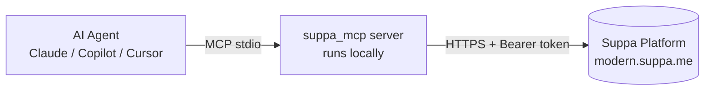

# Connecting the Suppa 2.0 MCP Server to Any Agent

This is a step‑by‑step plan to connect the Suppa 2.0 MCP Server to any
MCP‑compatible AI agent and use it for day‑to‑day development against the Suppa
platform.

---

## 1. How it works (architecture)



- The agent talks to the server over the **MCP stdio transport** — it only sees
  *tool names and results*, never your credentials.
- The server reads `SUPPA_API_KEY` from its **local environment** and adds it to
  the `Authorization` header of each HTTPS request.
- Because the server runs on your machine, there are no CORS/proxy/sandbox‑domain
  problems.

**Security boundary:** the API key never leaves your machine and is never placed
in the model context.

---

## 2. One‑time setup

### 2.1 Prerequisites
- Python **3.10+** on PATH (`python --version`).
- A Suppa token. Either:
  - a **user JWT** (full access incl. Tasks) — copy the `accessToken` cookie from
    the browser while logged into `modern.suppa.me`, or
  - an **integrator API key** (Docs/Entities/Forms/Users).

### 2.2 Install the server
```bash
# from a clone of the repo
cd suppa2.0-mcp-server
pip install -e .

# …or directly from the repository
pip install "git+https://git.modern-expo.com/asu/me-development/skills.git#subdirectory=suppa2.0-mcp-server"
```

### 2.3 Provide the token
Create a `.env` next to the project (it is git‑ignored), **or** pass the value in
the agent's `env` block (next section).

```ini
SUPPA_API_KEY=your-jwt-or-api-key
SUPPA_BASE_URL=https://modern.suppa.me
SUPPA_LANG=en
SUPPA_TZ=Europe/Kyiv
```

### 2.4 Smoke test (optional)
```bash
python -m suppa_mcp   # should start and wait on stdio (Ctrl+C to exit)
```

---

## 3. Connect your agent

Every MCP client uses the same launch command:
`python -m suppa_mcp` with the env var set.

### Claude Desktop
Edit `claude_desktop_config.json`
(`%APPDATA%/Claude/` on Windows, `~/Library/Application Support/Claude/` on macOS):
```json
{
  "mcpServers": {
    "suppa": {
      "command": "python",
      "args": ["-m", "suppa_mcp"],
      "env": { "SUPPA_API_KEY": "your-token-here" }
    }
  }
}
```

### VS Code (GitHub Copilot agent mode)
Create `.vscode/mcp.json` in your workspace:
```json
{
  "servers": {
    "suppa": {
      "command": "python",
      "args": ["-m", "suppa_mcp"],
      "env": { "SUPPA_API_KEY": "your-token-here" }
    }
  }
}
```
Then open the Copilot Chat **Agent** mode → the `suppa_*` tools appear in the tool
picker.

### Cursor
`Settings → MCP → Add new server`:
```json
{
  "suppa": {
    "command": "python",
    "args": ["-m", "suppa_mcp"],
    "env": { "SUPPA_API_KEY": "your-token-here" }
  }
}
```

### Windsurf / any other MCP client
Add a stdio server with command `python`, args `["-m", "suppa_mcp"]`, and the
`SUPPA_API_KEY` environment variable. That is all any compliant client needs.

> Tip: prefer the `env` block over a committed `.env` so each developer keeps
> their own token. Never commit real tokens.

---

## 4. Verify the connection

Ask the agent:

- “**List my Suppa documents.**” → calls `suppa_list_docs`.
- “**Who am I in Suppa?**” → calls `suppa_get_me` (needs a user JWT).
- “**List the entities in Suppa.**” → calls `suppa_list_entities`.

If these return data, the connection works.

---

## 5. Using it for development

Typical agent‑driven workflows now available without leaving your editor:

| Goal | Ask the agent… | Tools used |
|------|----------------|------------|
| Triage work | “Show my active tasks and overdue ones.” | `suppa_search_tasks` |
| Create work | “Create a task ‘Fix login bug’ assigned to me, due tomorrow.” | `suppa_create_task` |
| Collaborate | “Comment on task 931692 and @mention Andrii.” | `suppa_add_comment` |
| Attach artefacts | “Attach ./build/report.pdf to task 931692.” | `suppa_attach_file` |
| Write docs | “Add a ‘Release notes’ page to doc 23 and fill it.” | `suppa_create_page`, `suppa_create_blocks` |
| Inspect schema | “Describe the Tasks entity fields.” | `suppa_describe_entity` |
| Query data | “Find Applications created this month.” | `suppa_search_records` |
| Build a form | “Generate a form from the Tasks entity and create it.” | `suppa_generate_form_schema`, `suppa_create_form` |

### Good practices
- **IDs are explicit.** Tools take numeric IDs; have the agent *search first*
  (`suppa_search_*` / `suppa_list_*`) then act.
- **HTML content.** Task/comment descriptions and doc blocks accept HTML; the
  server wraps plain text automatically.
- **Dates.** `deadline` accepts `today`, `tomorrow`, `+3d`, `+2h`, `+30m`, or ISO.
- **Tasks need a user JWT.** Swap `SUPPA_API_KEY` to a user token if task tools
  return empty.
- **Reversibility.** Deletes are soft‑deletes; still confirm before bulk changes.

---

## 6. Troubleshooting

| Symptom | Cause | Fix |
|---------|-------|-----|
| `SUPPA_API_KEY environment variable is not set` | No token in env/.env | Set it in the agent `env` block |
| Empty task results | Integrator key, not a user | Use a user JWT |
| `HTTP 401` | Expired/invalid token | Refresh the token |
| `HTTP 400 Field … not found` | Wrong field projection | Update the server; report the entity/field |
| Agent shows no `suppa_*` tools | Server not launched | Check `python -m suppa_mcp` runs and config path is correct |

---

## 7. Updating

```bash
cd suppa2.0-mcp-server
git pull
pip install -e .   # picks up new tools/fixes
```

Restart the agent (or reload the MCP server) to load changes.
